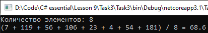

# Lesson9_task3
Условия задачки:
>Используя Visual Studio, создайте проект по шаблону Console Application.  
Создайте анонимный метод, который принимает в качестве аргумента массив делегатов и возвращает среднее арифметическое возвращаемых значений методов сообщенных с делегатами в массиве. 
Методы, сообщенные с делегатами из массива, возвращают случайное значение типа int. 

Подытог: вот такенный майндфак на выходе
>
